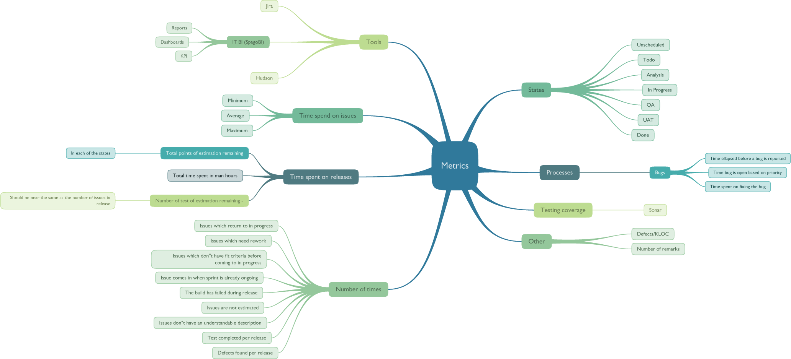

twyg – Generative tree visualiser for Python
============================================

**twyg** lets you visualise arbitrary tree structures in a pretty way. The
appearance of the tree (layout, color, node, connection shapes etc.) is
fully controlled via configuration files in a generative way. This means that
almost all visual properties of the output can be controlled by expressions
that depend on the characteristics of the tree (e.g. the color or shape of a
node can be a function of its hierarchical position in the tree). This allows
for crafting very flexible configurations that can be applied to trees of
arbitrary size and complexity.

Features
--------

- Compatible with Python 2.5, 2.6 and 2.7
- Supports the **Cairo** and **NodeBox1** rendering backends
- 16 visually fine-tuned built-in configurations
- 32 attractive looking colorschemes
- Simple JSON files as input
- PNG, PDF, SVG and PostScript output using the Cairo backend
- Fully customisable node and connection shapes and coloring algorithms
- High-quality font rendering via Cairo
- Gradient and drop shadow support, even in PDF and PostScript files
- Custom human-readable configuration language that allows the visual
  properties of the tree to be defined as expressions of arbitraty complexity
- Ability to cascade configurations and configuration sections
- Full `CSS3 color notation <http://www.w3.org/TR/css3-color/#colorunits>`_
  and `SVG 1.0 color keyword name
  <http://www.w3.org/TR/css3-color/#svg-color>`_ support
- Extensive reference documentation

Installation & Usage
--------------------

For detailed instructions, please refer to the `user documentation
<http://www.johnnovak.net/twyg/docs/>`_.

License
-------

© Copyright 2011-2014, `John Novak <http://www.johnnovak.net/>`_.
This project is released under the MIT license.

