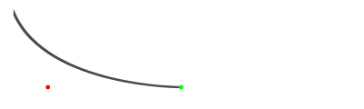
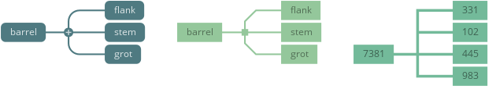

Connections
===========

The *connection* configuration section controls how the connections between the
nodes are drawn. These properties do not affect the positioning of the nodes,
they only control the visual appearance of the connection shapes.

'curve' style
-------------

The *curve* connection style draws a curve like shape between two connected
nodes. The shape is composed of two Bezier curves that are capped at both ends.
It is possible to configure the start and end widths of the connection shape
and various factors that affect the positioning of the curves' control points.

If a parent node has only a single child node, then connection is drawn
as a straight line.

.. image:: figures/images/connections-curve.png

Properties
^^^^^^^^^^

.. property:: nodeLineWidthStart

    .. propparams:: Number 9.8    
       :values: >0.0

    Width of the connection curve at the start (parent node end).

.. property:: nodeLineWidthEnd

    .. propparams:: Number 1.4
       :values: >0.0

    Width of the connection curve at the end (child node end).

.. property:: nodeCx1Factor

    .. propparams:: Number 0.7

    X-factor of the first control point of the connection curve. The X
    position of the first control point is calculated by multiplying
    this value by the horizontal distance between the two nodes then
    adding the result to the X position of the parent node. It is
    recommended to use values between *0.0* and *1.0* for property.

    

.. property:: nodeCx2Factor

    .. propparams:: Number .28

    X-factor of the second control point of the connection curve. The X
    position of the second control point is calculated by multiplying
    this value by the horizontal distance between the two nodes then
    adding the result to the X position of the child node. It is
    recommended to use values between *0.0* and *1.0* for this property.

.. property:: nodeCy1Factor

    .. propparams:: Number 0.0

    Y-factor of the first control point of the connection curve. The Y
    position of the first control point is calculated by multiplying
    this value by the vertical distance between the two nodes then
    adding the result to the Y position of the parent node. It is
    recommended to use values between *0.0* and *1.0* for property.

.. property:: nodeCy2Factor

    .. propparams:: Number 0.0

    Y-factor of the second control point of the connection curve. The Y
    position of the second control point is calculated by multiplying
    this value by the vertical distance between the two nodes then
    adding the result to the Y position of the child node. It is
    recommended to use values between *0.0* and *1.0* for property.

'junction' style
----------------

The *junction* connection style connects nodes with shapes that resemble a fork
with an optional junction sign . The branches of the fork consist of line
segments that are always parallel with the coordinate axes. It is possible to
configure the position and appearance of the junction point of the fork and the
shape of the corners where the horizontal and vertical lines meet.

Properties
^^^^^^^^^^

.. property:: lineWidth

    .. propparams:: Number 4.0
       :values: >0.0

    Width of the line connecting the nodes.

.. property:: junctionXFactor

    .. propparams:: Number 0.4
       :values: 0.0–1.0

    Horizontal position of the junction sign in relation to the total
    horizontal width of the connection line A value of *0.0* positions the
    junction sign at the parent node end of the connection and a value of *1.0*
    and the child node's end.

    .. image:: figures/images/connections-junction-junctionXFactor.png

.. property:: cornerStyle

    .. propparams:: Enum rounded
       :values: square, beveled, rounded

    Style of the corners of the connection lines. 

    .. image:: figures/images/connections-junction-cornerStyle.png

.. property:: cornerRadius

    .. propparams:: Number 12.0
       :values: >0.0

    Radius of the corners of the connection lines. The value has no effect if
    the :ref:property:`cornerStyle` property is set to *square*.

    The radius is automatically capped at the maximum allowable value to
    prevent the connection shapes from overlapping. This lends itself to a neat
    trick to draw the corners always with the maximum allowable radius by
    setting the corner radius to a very large value.

    .. image:: figures/images/connections-junction-cornerRadius.png

.. property:: junctionStyle

    .. propparams:: Enum disc
       :values: none, square, disc, diamond.

    Style of the junction shape.

    .. image:: figures/images/connections-junction-junctionStyle.png

.. property:: junctionRadius

    .. propparams:: Number 10.0
       :values: >0.0

    Radius of the junction shape.

.. property:: junctionFillColor

    .. propparams:: Color baseColor

    Fill color of the junction shape.

.. property:: junctionStrokeWidth

    .. propparams:: Number 2.0
       :values: >0.0

    Stroke width of the outline of the junction shape.

.. property:: junctionStrokeColor

    .. propparams:: Color baseColor

    Stroke color of the outline of the junction shape.

.. property:: junctionSign

    .. propparams:: Enum none
       :values: none, plus, minus

    Style of the sign inside the junction shape.

    .. image:: figures/images/connections-junction-junctionSign.png

.. property:: junctionSignSize

    .. propparams:: Number 10.0
       :values: >0.0

    Size of the junction sign.

.. property:: junctionSignStrokeWidth

    .. propparams:: Number 2.0
       :values: >0.0

    Stroke width of the junction sign.

.. property:: junctionSignColor       

    .. propparams:: Color baseColor.blend(bgColor, .7)

    Color of the junction sign.

