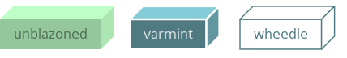
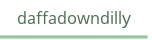
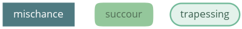

Nodes
=====

These properties are common to all node drawers. Lorem ipsum dolor
sit amet, consectetur adipiscing elit. Etiam cursus sit amet justo nec
lacinia. Pellentesque id hendrerit eros. Suspendisse a nunc enim.
Quisque vitae velit dolor.

Vivamus aliquam fringilla metus, sit amet tempor lectus pretium non.
Integer et tempor eros. Donec posuere dignissim nulla, non rutrum ipsum
gravida ut. Maecenas nec lectus eget metus congue blandit. Suspendisse
sed tortor vel neque vestibulum iaculis nec non mi. Nam porttitor
vehicula pharetra.

Common properties
-----------------

The properties below apply to all node styles so they are listed only
once in this section.

Text properties
^^^^^^^^^^^^^^^

.. property:: fontName

    .. propparams:: String "Gill Sans"

    Name of the font to draw the node text with. Normal font weights are
    always used.
    
    .. note:: Different graphics backends and operating systems may
        resolve font names differently, so for example the value
        "Helvetica" might result in a different font being picked up by
        NodeBox on Mac OS X than the by the command line application on
        Windows, which uses the Cairo backend.
        
        The *fontName* property is usually not portable across different
        operating system and graphics backend combinations and it needs
        to be adjusted accordingly.

.. property:: lineHeight

    .. propparams:: Number 1.3
       :values: >0.0

    Line height of the node text expressed as a multiplier of the font size.

.. property:: textAlign

    .. propparams:: Enum auto
        :values: left | right | center | justify | auto

    Alignment of the text within the node shape. The value *auto* aligns
    the text left, right or center depending on the node's orientation
    in relation to its parent (center alignment is used for the root
    node only).

.. property:: justifyMinLines

    .. propparams:: Number 5
       :values: >0

    If *textAlign* is set to *justify*, this property specifies the
    minimum number of node text lines for the full justification to take
    effect.  If the total number of lines is below this value, the text
    will be cente aligned instead.

.. property:: hyphenate

    .. propparams:: Boolean yes

    Controls whether the node text should be hyphenated if it spans
    multiple lines.

    .. note:: Hyphenation is supported for English text only.

.. property:: maxTextWidth

    .. propparams:: Number 240.0
       :values: >0.0

    Maximum width of the node text in points. If the full text does not
    fit into a single line having this width, the text will be broken
    into multiple lines and it will be aligned according to the value of
    the *textAlign* property.

.. property:: textPadX

    .. propparams:: Number fontSize * 1.0
       :values: >0.0

    Horizontal padding in points between the bounding rectangle of the node text
    and the node shape. It is recommended to set this value proportional
    to the font size.

.. property:: textPadY

    .. propparams:: Number fontSize * 0.45
       :values: >0.0

    Vertical padding in points between the bounding rectangle of the node text
    and the node shape. It is recommended to set this value proportional
    to the font size.

.. property:: textBaselineCorrection

    .. propparams:: Number -0.2

    Vertical node text baseline correction factor expressed as a
    fraction of the font size. Positive values move the baseline
    upwards, negative downwards.

    .. note:: Similarly to the *fontName* property, different graphics
        backends and operating systems require slightly different
        *textBaselineCorrection* values for the node text to appear
        vertically centered. The value may need to be adjusted for every
        operating system and graphics backend combination.

Stroke properties
^^^^^^^^^^^^^^^^^

.. property:: strokeWidth

    .. propparams:: Number 1.3
       :values: >0.0

    Stroke width of the outline of the node shape. A value of *0.0*
    results in no outline.

Node shadow properties
^^^^^^^^^^^^^^^^^^^^^^

.. property:: nodeDrawShadow

    .. propparams:: Boolean no

    Controls whether the node shape casts a shadow.

.. property:: nodeShadowColor

    .. propparams:: Color rgba(0, 0, 0, 0.2)

    Node shadow color.

.. property:: nodeShadowBlur

    .. propparams:: Number 3.0
       :values: >0.0

    Node shadow blur radius.

.. property:: nodeShadowOffsX

    .. propparams:: Number 2.5

    Horizontal offset of the node shadow.

.. property:: nodeShadowOffsY

    .. propparams:: Number 2.5

    Vertical offset of the node shadow.

.. property:: textDrawShadow

    .. propparams:: Boolean no

    Controls whether the node text casts a shadow.

Text shadow properties
^^^^^^^^^^^^^^^^^^^^^^

.. property:: textShadowColor

    .. propparams:: Color rgba(0, 0, 0, 0.5)

    Text shadow color.

.. property:: textShadowOffsX

    .. propparams:: Number -0.6

    Horizontal offset of the text shadow.

.. property:: textShadowOffsY

    .. propparams:: Number -0.6

    Vertical offset of the text shadow.

.. property:: drawGradient

    .. propparams:: Boolean no

    Controls whether the node shape should be filled using a linear top-down
    gradient.

.. property:: gradientTopColor

    .. propparams:: Color baseColor.lighten(.12)

    Color of the top of the node if the node shade is filled with a gradient.

.. property:: gradientBottomColor

    .. propparams:: Color baseColor.darken(.04)

    Color of the bottom of the node if the node shade is filled with a
    gradient.

'box' style
-----------

These properties are common to all node drawers. Lorem ipsum dolor sit amet, consectetur adipiscing elit. Etiam cursus sit amet justo nec lacinia. Pellentesque id hendrerit eros. Suspendisse a nunc enim. Quisque vitae velit dolor.

Properties
^^^^^^^^^^

.. property:: boxOrientation

    .. propparams:: Enum topright
       :values: topleft | topright | bottomleft | bottomright

    3D orientation of the box.

.. property:: boxDepth

    .. propparams:: Number 20 * pow(0.7, depth)
       :values: >0.0

    3D depth of the box.

.. property:: horizSideColor

    .. propparams:: Color baseColor.lighten(0.34)

    Color of the horizontal side of the 3D box.

.. property:: vertSideColor

    .. propparams:: Color baseColor.lighten(0.12)

    Color of the vertical side of the 3D box.

.. property:: strokeColor

    .. propparams:: Color baseColor

    Stroke color of the box.

'line' style
------------

These properties are common to all node drawers. Lorem ipsum dolor sit amet, consectetur adipiscing elit. Etiam cursus sit amet justo nec lacinia. Pellentesque id hendrerit eros. Suspendisse a nunc enim. Quisque vitae velit dolor.

Properties
^^^^^^^^^^

None.

'oval' style
------------

These properties are common to all node drawers. Lorem ipsum dolor sit amet, consectetur adipiscing elit. Etiam cursus sit amet justo nec lacinia. Pellentesque id hendrerit eros. Suspendisse a nunc enim. Quisque vitae velit dolor.

Properties
^^^^^^^^^^

.. property:: aspectRatio

    .. propparams:: Number 1.0
       :values: >0.0

    Initial aspect ratio of the oval.

.. property:: maxWidth

    .. propparams:: Number 400.0
       :values: >0.0

    Maximum width of the oval (the initial aspect ratio is kept until
    this width is reached).

'poly' style
------------

These properties are common to all node drawers. Lorem ipsum dolor sit amet, consectetur adipiscing elit. Etiam cursus sit amet justo nec lacinia. Pellentesque id hendrerit eros. Suspendisse a nunc enim. Quisque vitae velit dolor.

Properties
^^^^^^^^^^

.. property:: numSides

    .. propparams:: Number 6
       :values: >0

    Number of sides of the regular polygon

.. property:: rotation

    .. propparams:: Number 0

    Rotation around the center point

'rect' style
------------

The *rect* style draws nodes as rectangular shapes that can be either
completely square (first example) or can have rounded corners drawn in
different rounding styles (last two examples).

Properties
^^^^^^^^^^

.. property:: roundingStyle

    .. propparams:: Enum screen
       :values: screen | arc

    Controls the rounding style of the rectangle. *screen* results in a
    shape similar to an old CRT television screen, *arc* draws a
    rectangle with rounded corners using quarter circle arc segments.

    .. image:: figures/node-rect-roundingStyle.png

.. property:: roundness

    .. propparams:: Number 1.0
       :values: 0.0–1.0

    Rectangle roundess factor if *roundingStyle* is set to *screen*. A
    value of *0.0* yields completely square corners and *1.0* fully
    rounded ones.

    .. image:: figures/node-rect-roundness.png

.. property:: cornerRadius

    .. propparams:: Number 5.0
       :values: >0.0

    If *roundingStyle* is set to *arc*, the rectangle corners are drawn
    using quarter circle arcs having this radius (in points). The radius
    is capped at half the node's height or width (whichever is lower) to
    prevent self-overlapping curves. This lends itself to a neat trick
    to draw capsule-like node shapes by setting the corner radius to a
    very large value (last example).

    .. image:: figures/node-rect-cornerRadius.png

